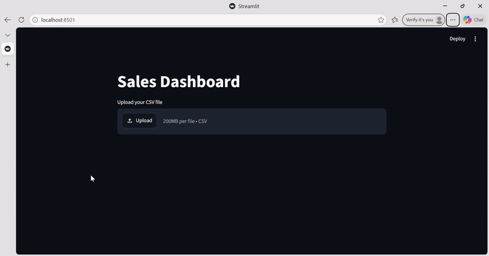

# Sales Dashboard

An interactive sales dashboard built with Python, Pandas and Streamlit.

## Features
◆ Upload your own CSV sales data
◆ Filter by city and category
◆ View KPIs: Total Sales, Total Orders, Average Order Value
◆ Bar chart: Sales by Category
◆ Line chart: Monthly Sales Trend

- ## Demo

## How to run
1. Install requirements: `pip install -r requirements.txt`
2. Run the app: `streamlit run app.py`
